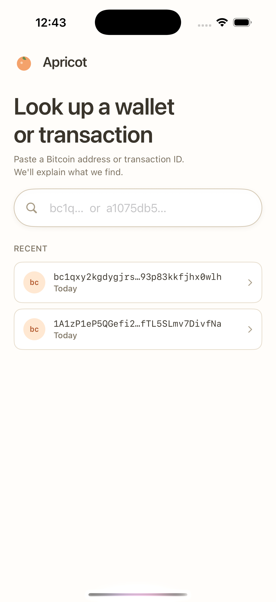
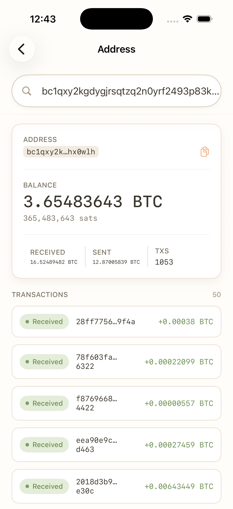
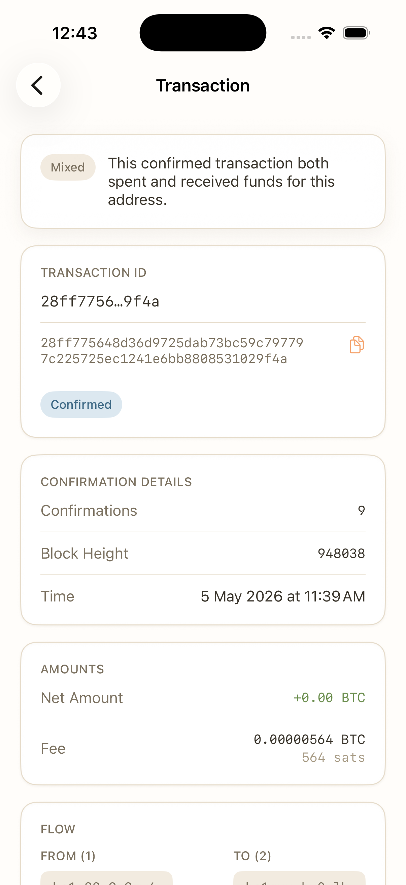
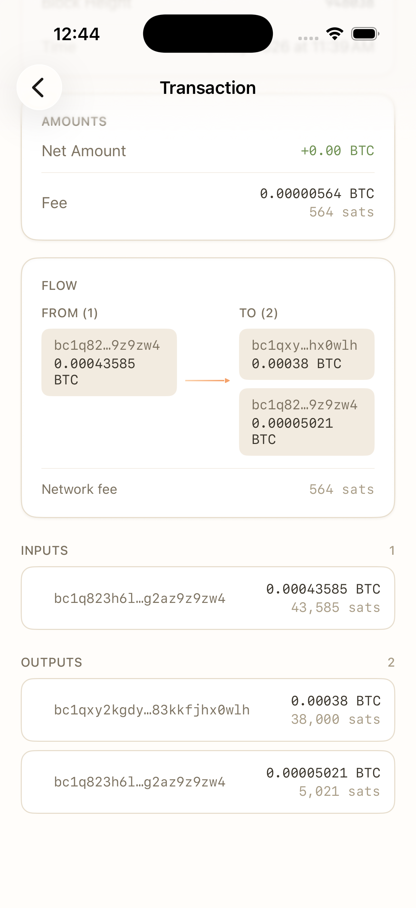
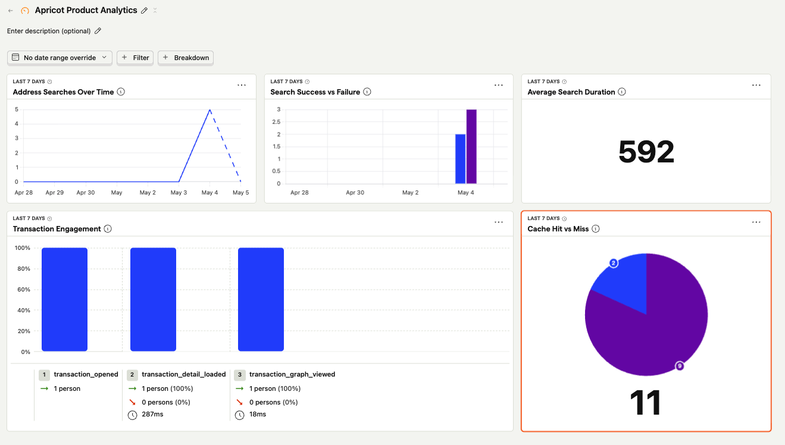

<p align="center">
  
</p>

<h1 align="center">Apricot</h1>

<p align="center">
  A human-friendly Bitcoin address explorer built with SwiftUI and Kotlin Multiplatform.
</p>

<p align="center">
  
  
  
  
</p>

---

Apricot lets users look up any public Bitcoin address, understand its balance and activity, and explore transactions through a clean visual interface — designed for people who want to understand what's happening on-chain without reading a block explorer.

This is a portfolio project focused on product quality, clean architecture, and modern engineering practices across the full mobile stack.

---

## Screenshots

<p align="center">
  
  
  
  
</p>

---

## Architecture

```
Apricot iOS App
├── SwiftUI Presentation
├── Apricot Design System
├── Observability
└── Shared KMP Module
    ├── Domain (Bitcoin models, repository interfaces)
    ├── Data (DTOs, mappers, Mempool.space repository)
    ├── Use Cases
    ├── Cache (in-memory TTL)
    └── Mempool API Client (Ktor)
```

**Layer ownership:**

| Layer | Owns |
|---|---|
| iOS app | SwiftUI views, navigation, app composition, design system, platform integrations |
| KMP shared module | Domain models, DTOs, mappers, repositories, use cases, API client, cache |

**Boundaries enforced by convention:**
- DTOs never reach the presentation layer — mappers convert them to domain models at the data boundary.
- Domain models never import API-specific types.
- The Mempool.space provider is hidden behind a `BitcoinRepository` interface; the iOS app never references it directly.
- Observability and feature flags are accessed through protocols so implementations can be swapped without touching call sites.

---

## Technical Highlights

### Kotlin Multiplatform shared layer

Business and data logic lives in a KMP module compiled to an XCFramework and embedded into the iOS app. The iOS app consumes domain models and use cases via Swift, with no knowledge of the underlying Kotlin types.

The KMP module includes:
- `BitcoinRepository` — repository interface and two concrete implementations: `MempoolBitcoinRepository` (live API) and `CachingBitcoinRepository` (TTL cache wrapper).
- Three use cases: `GetAddressSummary`, `GetAddressTransactions`, `GetTransactionDetail`.
- DTO types for the Mempool.space API and mappers that convert them to clean domain models.
- An in-memory TTL cache with differentiated TTLs: confirmed transaction details are cached longer than pending ones; address summaries and transaction lists use short TTLs.

### Design system

The app ships its own design system implemented in Swift:
- **Tokens**: `ApricotColors` (warm pastel palette with light/dark variants), `ApricotTypography` (Geist sans + JetBrains Mono), `ApricotSpacing`.
- **Components**: `ApricotButton`, `ApricotCard`, `ApricotStatCard`, `ApricotSearchField`, `ApricotBadge`, `MonoText`, `ApricotLoadingState`, `ApricotErrorState`, `ApricotEmptyState`.
- Blockchain-specific values (addresses, transaction IDs, fees, amounts) are always rendered in `MonoText` — a styled monospaced component that gives them a distinct, readable appearance.

Reference files for the design system are in `docs/design/`.

---

## Observability & Feature Flags

Both are abstracted behind protocols so they can be swapped without changing call sites.

### PostHog integration (optional)

PostHog powers remote feature flags and production analytics. Configuration is read from a local xcconfig file that is not committed to the repo.

To configure PostHog locally:

```bash
cp Config/Apricot.example.xcconfig Config/Apricot.local.xcconfig
# then edit Config/Apricot.local.xcconfig and add your key and host
```

```
APRICOT_POSTHOG_API_KEY = phc_your_key_here
APRICOT_POSTHOG_HOST = https://us.i.posthog.com
```

After editing, run `make xcode` to regenerate the Xcode project.

### Without PostHog credentials

The app builds and runs for any contributor without PostHog access:
- Feature flags fall back to `LocalFeatureFlags` with all flags enabled.
- Analytics fall back to `ConsoleAnalyticsTracker`, which logs events to the console via `ConsoleLogger`.

### Analytics events

All events use privacy-safe previews. Addresses are truncated to 10 characters and transaction IDs to 8+4 characters — full values are never sent.

| Event | Properties |
|---|---|
| `address_search_started` | `address_preview` |
| `address_search_succeeded` | `address_preview`, `result_count`, `duration_ms` |
| `address_search_failed` | `address_preview`, `error_category`, `duration_ms` |
| `transaction_opened` | `tx_id_preview`, `address_preview` |
| `transaction_detail_loaded` | `tx_id_preview`, `duration_ms` |
| `transaction_detail_failed` | `tx_id_preview`, `error_category`, `duration_ms` |
| `transaction_graph_viewed` | `tx_id_preview` |
| `recent_search_selected` | `address_preview` |
| `cache_hit` | `resource`, `key_preview` |
| `cache_miss` | `resource`, `key_preview` |

### Feature flags

The initial remote flag is `address-insights-enabled` (PostHog key) → `addressInsightsEnabled` (app code). When enabled, the app shows additional address-level insights: first/last activity, incoming/outgoing/mixed transaction classification, and a simple activity summary.


### Dashboard

<p align="center">
  
</p>

---

## Testing & CI

### KMP tests

Unit tests for domain models, DTO mappers, use cases, cache hit/miss/expiration, and repository behavior.

```bash
./gradlew :shared:allTests
```

### iOS unit tests

ViewModel state transition tests and business logic tests.

```bash
xcodebuild -project Apricot.xcodeproj -scheme ApricotUnitTests \
  -destination 'platform=iOS Simulator,name=iPhone 17' test
```

### Snapshot tests

Snapshot tests live under `ApricotSnapshotTests/` and use fixed Swift-only fixtures — no network calls, no PostHog, no real KMP layer. All snapshots are recorded at a fixed 390×844 light-mode configuration for determinism.

```bash
# Run locally
xcodebuild -project Apricot.xcodeproj -scheme ApricotSnapshotTests \
  -destination 'platform=iOS Simulator,name=iPhone 17' test

# Record or refresh reference images
make record-snapshots
```

Reference images are committed under `ApricotSnapshotTests/Snapshots/__Snapshots__/`.

> **Note:** Snapshot test execution in CI is currently disabled. macOS CI runners and local Xcode environments can produce subtly different rendering output, causing spurious failures. The infrastructure is in place — it's a known limitation to address before shipping.

### GitHub Actions CI

The CI pipeline runs on every pull request and push to `main`:

| Job | Runner | What it checks |
|---|---|---|
| SwiftLint | macos-latest | Lint rules via `make lint` |
| SwiftFormat | macos-latest | Formatting via `make format-check` |
| KMP Tests | macos-latest | All Kotlin shared module tests |
| iOS Unit Tests | macos-15 | ApricotUnitTests scheme |
| iOS Build | macos-15 | App compiles cleanly for simulator |

---

## Getting Started

### Requirements

- Xcode 15.x
- Java 17+ (for Gradle)
- `xcodegen` — `brew install xcodegen`
- `swiftlint` and `swiftformat` — `brew install swiftlint swiftformat`

### First-time setup

```bash
make bootstrap   # builds KMP XCFramework, then generates Apricot.xcodeproj
```

Open `Apricot.xcodeproj` in Xcode after running bootstrap.

### Common commands

```bash
make kmp              # rebuild KMP XCFramework (required after shared/ changes)
make xcode            # regenerate Apricot.xcodeproj from project.yml
make lint             # run SwiftLint
make format           # format Swift files
make format-check     # check formatting without modifying files
make clean            # clean Gradle outputs and remove generated Xcode project
```

---

## Known Limitations & Future Work

- **Snapshot tests in CI** — disabled due to rendering differences between local Xcode environments and macOS CI runners. Infrastructure is ready; execution pending a stable approach.
- **UI tests** — the happy path (search → transaction detail) is planned but not yet implemented.
- **Error handling** — basic error states are in place; deeper recovery flows are out of scope for the MVP.
- **Single data provider** — Mempool.space is the only backend. The repository interface is designed to support additional providers.
- **Bitcoin only** — Ethereum and other chains are out of scope.
- **No wallet connection** — read-only explorer; no key management, signing, or transaction broadcasting.
- **No App Store release** — this is a portfolio project, not a production app.
